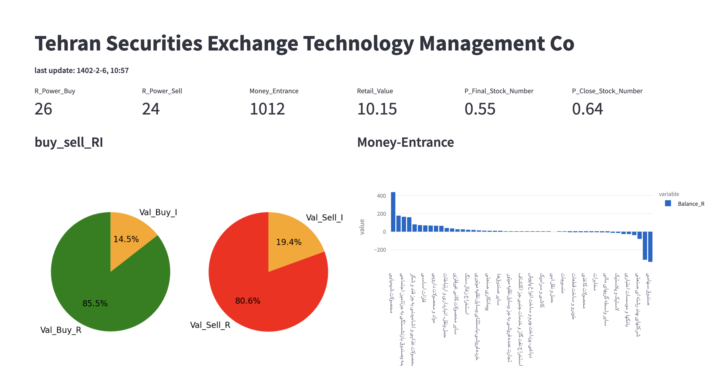

# stream_tsetmc

I have developed a initial Dashboard for tracking last state of trades on tsetmc (Tehran Securities Exchange Technology Management Co) in python. mian package that is used is the streamlit.
 
install streamlit and run in your terminal: streamlit run market_stream.py

